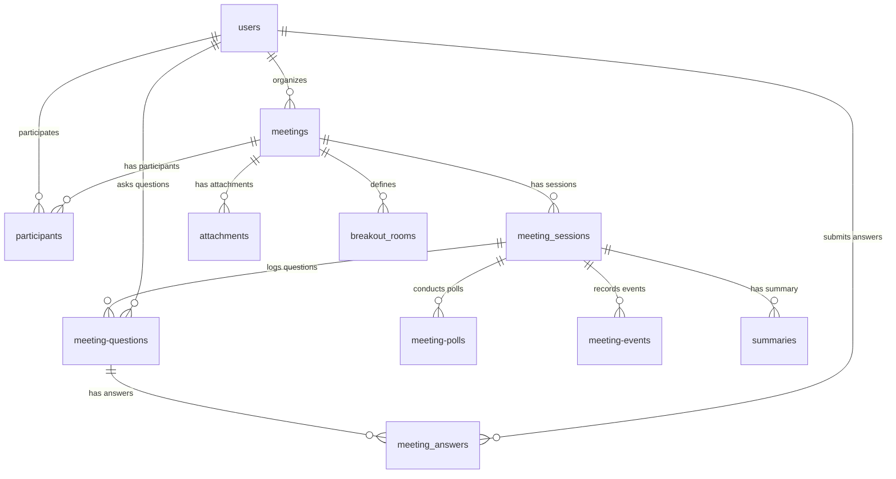

# Báo cáo Tiến độ Phát triển Hệ thống (MeetMind Development Progress)

Tài liệu này tổng hợp trạng thái phát triển thực tế của tất cả các module trong nền tảng MeetMind (Backend & Frontend) tính đến ngày **06/06/2026**.

---

## 📊 Bảng tổng quan Tiến độ Module

| STT | Tên Module | Trạng thái Backend | Trạng thái Frontend | Tài liệu Kỹ thuật | Ghi chú & Tính năng nổi bật |
| :--- | :--- | :---: | :---: | :---: | :--- |
| 1 | **Xác thực & Người dùng** (Auth & Users) | ✅ Hoàn thành | ✅ Hoàn thành | [auth-users.md](file:///home/theanh/meetmind/docs/auth-users.md) | Đăng nhập Google OAuth SSO, JWT authentication, Route Guards. |
| 2 | **Quản lý Cuộc họp Cốt lõi** (Meetings) | ✅ Hoàn thành | ✅ Hoàn thành | [meetings.md](file:///home/theanh/meetmind/docs/meetings.md) | WebRTC LiveKit, Phòng chờ (Lobby), Lên lịch họp & Xung đột thời gian. |
| 3 | **Chia phòng nhỏ** (Breakout Rooms) | ✅ Hoàn thành | ✅ Hoàn thành | [breakout-rooms.md](file:///home/theanh/meetmind/docs/breakout-rooms.md) | Host Observer/Join, Khôi phục phiên thảo luận (Rejoin), Trì hoãn 4s (Grace Period). |
| 4 | **Hỏi & Đáp** (Q&A / Discussion) | ✅ Hoàn thành | ✅ Hoàn thành | [qa.md](file:///home/theanh/meetmind/docs/qa.md) | Host đặt câu hỏi, phân quyền hiển thị câu trả lời (Filter), LiveKit Data Channel sync. Tích hợp tab chi tiết lịch sử Hỏi đáp cuộc họp. |
| 5 | **Bình chọn** (Polls) | ✅ Hoàn thành | ✅ Hoàn thành | [polls.md](file:///home/theanh/meetmind/docs/polls.md) | Bình chọn Đơn/Đa lựa chọn, biểu đồ kết quả (%) thời gian thực, Khóa bình chọn. Tích hợp tab thống kê chi tiết tỷ lệ % phiếu bầu và danh sách người bình chọn. |
| 6 | **Tóm tắt cuộc họp AI** (Summaries) | ✅ Hoàn thành | ✅ Hoàn thành | [summaries.md](file:///home/theanh/meetmind/docs/summaries.md) | Tóm tắt chạy nền (Background job), Trình soạn mẫu tùy biến (Notion-style Live Preview). |
| 7 | **Hỏi đáp AI Chatbot** (AI Chatbot Q&A) | ✅ Hoàn thành | ✅ Hoàn thành | [meetings.md](file:///home/theanh/meetmind/docs/meetings.md) | RAG Vector (`pgvector`), Streaming SSE, Tích hợp Slide Capture. Hỗ trợ **Gemini Function Calling** tự động truy xuất dữ liệu Polls & Q&A trong cuộc họp khi người dùng hỏi. |
| 8 | **Nhật ký & Sự kiện** (Events) | ✅ Hoàn thành | ✅ Hoàn thành | [events.md](file:///home/theanh/meetmind/docs/events.md) | Ghi nhận timeline sự kiện phiên họp, bộ lọc tìm kiếm, thống kê số liệu phiên. |
| 9 | **Tệp đính kèm** (Attachments) | ✅ Hoàn thành | ⚠️ Placeholder | [attachments.md](file:///home/theanh/meetmind/docs/attachments.md) | Backend đã có đủ APIs & DB. Frontend hiện tại hiển thị giao diện chờ (Coming Soon). |

*Chú dẫn trạng thái:*
* ✅ **Hoàn thành:** Đã viết mã nguồn chạy ổn định, kết nối thông suốt giữa FE và BE.
* ⚠️ **Placeholder (Sắp ra mắt):** Backend sẵn sàng nhưng giao diện Frontend mới chỉ là khung chờ, chưa tích hợp chức năng thật.

---

## 🗄️ Bản đồ Thực thể Cơ sở dữ liệu (Database Schema Map)

Dưới đây là liên kết các bảng trong cơ sở dữ liệu PostgreSQL của hệ thống:

---

## 🔌 Danh mục các Endpoint APIs chính của Hệ thống

Dưới đây là các đường dẫn API tương tác giữa Frontend và Backend:

### 1. Module Xác thực (`/auth`)
* `GET /auth/google` -> Kích hoạt đăng nhập Google.
* `GET /auth/google/callback` -> Google callback và trả JWT Token về FE.
* `GET /auth/verify` -> Xác minh token JWT và lấy profile người dùng.

### 2. Module Cuộc họp & AI (`/meetings`)
* `POST /meetings` -> Tạo cuộc họp mới.
* `GET /meetings` -> Danh sách cuộc họp của người dùng (phân trang).
* `GET /meetings/:id` -> Chi tiết cuộc họp.
* `POST /meetings/:id/end` -> Đóng phòng họp (Host).
* `POST /meetings/:id/chat/stream` -> Hỏi đáp stream SSE với AI (RAG + pgvector).
* `GET /meetings/:id/chat/history` -> Lịch sử nhắn tin với chatbot.
* `GET /meetings/check-conflict` -> Kiểm tra xung đột lịch biểu cuộc họp.

### 3. Module Chia phòng họp nhỏ (`/meetings/:meetingId/breakout-rooms`)
* `POST /.../setup` -> Lưu cấu hình các phòng nhỏ và gán người dùng.
* `POST /.../start` -> Bắt đầu chia phòng nhỏ (tạo phòng LiveKit WebRTC).
* `POST /.../end` -> Thu hồi tất cả thành viên về phòng chính.
* `GET /.../my-token` -> Lấy token LiveKit phòng nhỏ của bản thân.
* `GET /.../:roomId/token-host` -> Host di chuyển vào phòng nhỏ được chọn.

### 4. Module Hỏi đáp (`/meetings/:meetingId/qa`)
* `GET /.../qa` -> Lấy danh sách câu hỏi thảo luận (`host_qa`).
* `POST /.../qa` -> Tạo câu hỏi mới (chỉ Host).
* `PATCH /.../qa/:id/status` -> Đổi trạng thái câu hỏi (`dismissed`/`answered`/`pending`).
* `POST /.../qa/:id/answers` -> Người tham gia gửi câu trả lời.

### 5. Module Bình chọn (`/meetings/:meetingId/polls`)
* `GET /.../polls` -> Lấy danh sách cuộc bình chọn.
* `POST /.../polls` -> Khởi tạo cuộc bình chọn mới (Host/Co-host).
* `POST /.../polls/:id/vote` -> Thực hiện bỏ phiếu (Single hoặc Multiple choice).
* `POST /.../polls/:id/close` -> Đóng/Khóa biểu quyết (Host).

### 6. Module Tóm tắt & Nhật ký (`/meetings/:meetingId`)
* `POST /.../summaries/generate` -> Bất đồng bộ kích hoạt tóm tắt AI (Background job).
* `GET /.../summaries` -> Danh sách các bản tóm tắt theo từng phiên họp.
* `GET /.../events` -> Truy xuất lịch sử dòng sự kiện (timeline log).
* `GET /.../sessions` -> Lịch sử các phiên họp thực tế đã diễn ra.

---

## 🎯 Kế hoạch & Đề xuất Cải tiến Tiếp theo

1. **Hoàn thiện Frontend Module Tệp đính kèm (Attachments):**
   * Thiết kế giao diện upload tệp trực quan (drag-and-drop) vào tab Tài nguyên cuộc họp.
   * Kết nối APIs lưu trữ tệp lên Server Local hoặc Cloud S3.
2. **Nâng cấp AI Chatbot (Multi-modal RAG):**
   * Tối ưu hóa thuật toán tìm kiếm Vector pgvector kết hợp ngữ cảnh hình ảnh.
3. **Mở rộng Audience Q&A:**
   * Cho phép người tham gia chủ động đặt câu hỏi tự do lên bảng câu hỏi chung (`type = audience_qa`).
   * Host phê duyệt duyệt câu hỏi trước khi cho cả phòng nhìn thấy và bình chọn câu hỏi hay (Upvote).
