# Tài liệu kỹ thuật: Module Xác thực & Người dùng (Authentication & Users)

Tài liệu này mô tả chi tiết kiến trúc, cơ sở dữ liệu, các API endpoints và thành phần giao diện của tính năng Xác thực tài khoản (Authentication) và Quản lý hồ sơ người dùng (Users) trong hệ thống MeetMind.

---

## 📌 Tổng quan tính năng

Hệ thống quản lý định danh người dùng trong MeetMind sử dụng tiêu chuẩn ngành để đảm bảo tính an toàn, bảo mật và trải nghiệm mượt mà (SSO):
* **Đăng nhập một chạm (Google OAuth SSO):** Tích hợp đăng nhập bằng tài khoản Google (OAuth 2.0). Hệ thống tự động tạo hồ sơ người dùng mới trong lần đăng nhập đầu tiên mà không yêu cầu điền biểu mẫu phức tạp.
* **Xác thực dựa trên mã JWT (Token-based Authentication):** Sau khi xác thực thành công qua Google, hệ thống cấp phát JWT (JSON Web Token) cho Client. Mã này được đính kèm ở header `Authorization: Bearer <token>` để bảo vệ các tuyến API nội bộ.
* **Hạn sử dụng & Tự động lưu trữ (Token Management):** Token được lưu trữ an toàn trong localStorage trên trình duyệt. Khi token hết hạn hoặc không hợp lệ, hệ thống tự động điều hướng người dùng ra trang Đăng nhập (`/login`).

---

## 🏗️ Kiến trúc & Luồng hoạt động (Workflows)

### Luồng Đăng nhập Google OAuth và cấp mã JWT

```mermaid
sequenceDiagram
    participant Client as Client Browser (FE)
    participant Backend as NestJS Auth Controller
    participant Google as Google OAuth Server
    participant DB as PostgreSQL Database

    Client->>Backend: GET /auth/google (Nhấn nút đăng nhập)
    Backend->>Google: Điều hướng sang Google Login Page
    Note over Google: Người dùng chọn tài khoản và chấp nhận quyền
    Google-->>Backend: Callback: GET /auth/google/callback?code=...
    
    rect rgb(30, 30, 40)
        Note over Backend: Validate Google Profile:
        Backend->>DB: Kiểm tra GoogleId trong bảng 'users'
        alt Người dùng chưa tồn tại
            Backend->>DB: Thêm mới User (firstName, lastName, email, picture)
        else Người dùng đã tồn tại
            Backend->>Backend: Trích xuất thông tin User sẵn có
        end
    end

    Backend->>Backend: Ký mã JWT Token (chứa userId làm 'sub' và email)
    Backend-->>Client: Redirect: /auth/callback?token=JWT_TOKEN
    Note over Client: FE lấy token từ URL -> lưu vào LocalStorage -> xóa token khỏi URL (history.replaceState)
    Client->>Backend: GET /auth/verify (Gửi kèm Authorization header)
    Backend-->>Client: Trả về thông tin User Profile -> Chuyển vào Dashboard
```


---

## 🗄️ Cơ sở dữ liệu (Database Schema)

Thông tin người dùng được lưu trữ trong bảng `users` với cấu trúc sau:

### `User` (Bảng `users`)

| Tên cột | Kiểu dữ liệu | Mô tả |
| :--- | :--- | :--- |
| `id` | `uuid` (PK) | Khóa chính của người dùng |
| `email` | `varchar` (Unique) | Email đăng ký (duy nhất) |
| `firstName` | `varchar` | Tên của người dùng |
| `lastName` | `varchar` | Họ của người dùng |
| `googleId` | `varchar` (Nullable) | ID định danh từ Google (cho đăng nhập SSO) |
| `picture` | `varchar` (Nullable) | URL ảnh đại diện đồng bộ từ Google Profile |
| `isActive` | `boolean` | Trạng thái hoạt động (mặc định `true`) |
| `createdAt` | `timestamp` | Thời gian tạo tài khoản |
| `updatedAt` | `timestamp` | Thời gian cập nhật thông tin |

---

## 🔌 API Endpoints

Mọi API nằm dưới tiền tố `/auth` hoặc các endpoint lấy thông tin hồ sơ:

### 1. Khởi động đăng nhập Google
* **Endpoint:** `GET /auth/google`
* **Công dụng:** Kích hoạt luồng xác thực Google Passport Strategy.

### 2. Callback nhận dữ liệu từ Google
* **Endpoint:** `GET /auth/google/callback`
* **Công dụng:** Google trả kết quả xác thực. Backend xử lý dữ liệu và điều hướng về Frontend kèm token JWT trên thanh địa chỉ.

### 3. Xác minh tính hợp lệ của Token
* **Endpoint:** `GET /auth/verify`
* **Yêu cầu:** Gửi kèm JWT token ở Header.
* **Phản hồi:**
  ```json
  {
    "isAuthenticated": true,
    "user": {
      "id": "user-uuid-12345",
      "email": "username@gmail.com",
      "firstName": "Anh",
      "lastName": "Tô Huy Thế",
      "picture": "https://lh3.googleusercontent.com/..."
    }
  }
  ```

---

## 💻 Thành phần Giao diện & Hooks (Frontend)

Mã nguồn Frontend quản lý phiên đăng nhập và định danh tập trung tại thư mục `frontend/src/features/auth/`:

### 1. Trình quản lý trạng thái Đăng nhập (AuthContext & Hooks)
* **[AuthContext.tsx](file:///home/theanh/meetmind/frontend/src/features/auth/AuthContext.tsx):**
  * Định nghĩa `AuthContext` bao bọc toàn bộ ứng dụng.
  * Cung cấp trạng thái xác thực 3 trạng thái: `loading` (đang xác minh token trên máy chủ), `authenticated` (đã đăng nhập) và `unauthenticated` (chưa đăng nhập).
  * Lắng nghe và kiểm tra token trong localStorage (`meetmind_token`) ngay khi ứng dụng khởi chạy.
  * Cung cấp các hàm `logout` để xóa token khỏi bộ nhớ và chuyển hướng người dùng về trang đăng nhập.

### 2. Các Trang giao diện
* **[LoginPage.tsx](file:///home/theanh/meetmind/frontend/src/features/auth/LoginPage.tsx):** Giao diện đăng nhập cao cấp, hiển thị nút "Đăng nhập bằng Google" hướng người dùng trực tiếp sang Backend API.
* **[AuthCallbackPage.tsx](file:///home/theanh/meetmind/frontend/src/features/auth/AuthCallbackPage.tsx):**
  * Điểm đón người dùng sau khi Google chuyển hướng thành công.
  * Đọc token từ tham số URL, lưu vào localStorage, dọn dẹp URL bằng cách gọi `history.replaceState` để bảo mật không lưu token trong lịch sử trình duyệt.
* **[ProtectedRoute.tsx](file:///home/theanh/meetmind/frontend/src/features/auth/ProtectedRoute.tsx):** Thành phần bảo vệ định tuyến (route guard). Nếu trạng thái là `unauthenticated`, nó tự động ngăn chặn truy cập và chuyển hướng về `/login`.
* **[ProfilePage.tsx](file:///home/theanh/meetmind/frontend/src/features/profile/ProfilePage.tsx):** Hiển thị chi tiết hồ sơ người dùng hiện tại (Họ tên, email, ảnh đại diện) lấy ra từ `useAuth()`.
