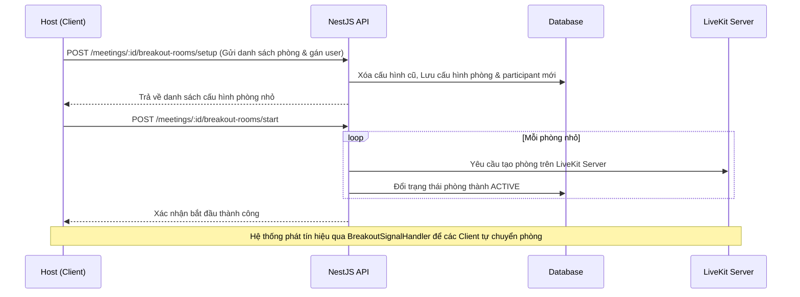

# Tài liệu kỹ thuật: Module Chia phòng họp nhỏ (Breakout Rooms)

Tài liệu này mô tả chi tiết kiến trúc, luồng hoạt động, cơ sở dữ liệu, các API endpoints và thành phần giao diện của tính năng Chia phòng họp nhỏ (Breakout Rooms) trong hệ thống MeetMind.

---

## 📌 Tổng quan tính năng

Tính năng Breakout Rooms cho phép Host (Chủ phòng) chia nhỏ người tham gia cuộc họp chính thành các nhóm nhỏ độc lập để thảo luận. Mỗi phòng nhỏ là một phòng LiveKit WebRTC riêng biệt. Sau khi kết thúc thảo luận, Host có thể thu hồi tất cả người dùng quay lại phòng chính.

### Các cơ chế đặc biệt:
* **Khôi phục phiên thảo luận (Rejoin):** Nếu người dùng bị mất kết nối đột ngột (Dirty Disconnect - tắt tab, mất mạng), cấu hình gán phòng vẫn được giữ lại. Khi họ vào lại cuộc họp, hệ thống tự động đưa họ trở lại phòng nhỏ.
* **Host quan sát & tham gia (Host Observer/Join):** Host có quyền đi vào bất kỳ phòng họp nhỏ nào để theo dõi và thảo luận cùng các nhóm, sau đó quay lại phòng chính mà không làm ảnh hưởng đến cấu hình chia phòng của nhóm đó.
* **Trì hoãn ngắt kết nối (Grace Period):** Sử dụng cache của NestJS kết hợp webhook của LiveKit để hoãn 4 giây trước khi đánh dấu người dùng offline, tránh hiện tượng chập chờn trạng thái (flickering) khi người dùng di chuyển giữa phòng chính và các phòng nhỏ.

---

## 🏗️ Kiến trúc & Luồng hoạt động (Workflows)

### 1. Luồng Host thiết lập và bắt đầu chia phòng


### 2. Luồng di chuyển phòng và xử lý Webhook
Khi người dùng chuyển đổi từ phòng chính sang phòng nhỏ (hoặc ngược lại), LiveKit Server và Backend xử lý đồng bộ trạng thái như sau:

```mermaid
sequenceDiagram
    participant Client as Client Browser
    participant LiveKit as LiveKit Server
    participant Backend as NestJS Webhook Service
    participant Cache as Cache Manager
    participant DB as Database

    Client->>LiveKit: Kết nối vào phòng nhỏ
    LiveKit->>Backend: Webhook: participant_joined (Room nhỏ)
    Backend->>Cache: Lưu active_room = Room nhỏ
    Backend->>DB: Cập nhật Participant: isInMeeting = true, status = admitted
    
    Note over Client, LiveKit: Sau đó ngắt kết nối khỏi phòng chính
    LiveKit->>Backend: Webhook: participant_left (Room chính)
    Note over Backend: Kích hoạt Grace Period (Delay 4s)
    rect rgb(30, 30, 40)
        Note over Backend: Sau 4s, kiểm tra Cache
        Backend->>Cache: Lấy active_room
        Cache-->>Backend: Trả về Room nhỏ
        Note over Backend: active_room đã thay đổi (không phải Room chính) -> Bỏ qua, không đánh dấu Offline
    end
```



---

## 🗄️ Cơ sở dữ liệu (Database Schema)

Tính năng này được quản lý qua hai thực thể chính nằm trong module `breakout-rooms`:

### 1. `BreakoutRoom` (Bảng `breakout_rooms`)
Lưu trữ thông tin cấu hình của từng phòng thảo luận nhỏ.

| Tên cột | Kiểu dữ liệu | Mô tả |
| :--- | :--- | :--- |
| `id` | `uuid` (PK) | Khóa chính của phòng nhỏ |
| `meetingId` | `uuid` (FK) | Liên kết với bảng `meetings` |
| `name` | `varchar` | Tên hiển thị của phòng (Ví dụ: "Phòng 1") |
| `livekitRoomName` | `varchar` | Tên vật lý duy nhất tạo trên LiveKit Server |
| `status` | `enum` | Trạng thái phòng (`created`, `active`) |
| `createdByUserId` | `uuid` | ID của Host tạo phòng |
| `createdAt` | `timestamp` | Thời gian tạo |

### 2. `BreakoutRoomParticipant` (Bảng `breakout_room_participants`)
Lưu trữ danh sách người dùng được gán vào từng phòng nhỏ.

| Tên cột | Kiểu dữ liệu | Mô tả |
| :--- | :--- | :--- |
| `id` | `uuid` (PK) | Khóa chính |
| `breakoutRoomId` | `uuid` (FK) | Liên kết với bảng `breakout_rooms` |
| `userId` | `uuid` (FK) | Liên kết với bảng `users` |
| `createdAt` | `timestamp` | Thời gian gán |

---

## 🔌 API Endpoints

Mọi API nằm dưới tiền tố `/meetings/:id/breakout-rooms` (Yêu cầu JWT Token ở header):

### 1. Thiết lập phòng nhỏ
* **Endpoint:** `POST /meetings/:id/breakout-rooms/setup`
* **Body:**
  ```json
  {
    "rooms": [
      {
        "name": "Nhóm 1",
        "assignments": [{ "userId": "user-uuid-1" }]
      },
      {
        "name": "Nhóm 2",
        "assignments": [{ "userId": "user-uuid-2" }]
      }
    ]
  }
  ```
* **Phản hồi:** Danh sách các phòng đã tạo kèm ID.

### 2. Bắt đầu chia phòng
* **Endpoint:** `POST /meetings/:id/breakout-rooms/start`
* **Phản hồi:** Xác nhận các phòng đã chuyển sang trạng thái `active`.

### 3. Kết thúc chia phòng (Thu hồi)
* **Endpoint:** `POST /meetings/:id/breakout-rooms/end`
* **Phản hồi:** `{"message": "Breakout rooms closed"}`. Xóa toàn bộ cấu hình phòng và assignments trong cơ sở dữ liệu.

### 4. Thành viên chủ động rời phòng nhỏ về phòng chính
* **Endpoint:** `POST /meetings/:id/breakout-rooms/leave`
* **Phản hồi:** 200 OK. Xóa bản ghi gán của user đó trong cơ sở dữ liệu để họ không bị kéo lại vào phòng nhỏ nữa.

### 5. Lấy token phòng nhỏ của bản thân (Client tự gọi)
* **Endpoint:** `GET /meetings/:id/breakout-rooms/my-token`
* **Phản hồi:**
  ```json
  {
    "token": "livekit-jwt-token...",
    "roomName": "Nhóm 1",
    "livekitRoomName": "breakout-meetingid-timestamp-random",
    "isBreakoutRoom": true
  }
  ```

### 6. Lấy token phòng nhỏ cho Host (Không lưu gán DB)
* **Endpoint:** `GET /meetings/:id/breakout-rooms/:roomId/token-host`
* **Phản hồi:** Trả về LiveKit token cho phép Host tham gia phòng nhỏ `roomId` đó mà không cần ghi nhận gán vĩnh viễn trong DB.

### 7. Lấy danh sách các phòng nhỏ
* **Endpoint:** `GET /meetings/:id/breakout-rooms`
* **Phản hồi:** Trả về danh sách phòng nhỏ kèm danh sách các thành viên được gán vào phòng.


---

## 💻 Thành phần Giao diện & Hooks (Frontend)

Mã nguồn frontend của module này được tổ chức gọn gàng tại thư mục `frontend/src/features/meetings/`:

### 1. Custom Hook `useBreakoutRoom`
Nằm tại [useBreakoutRoom.ts](file:///home/theanh/meetmind/frontend/src/features/meetings/hooks/useBreakoutRoom.ts). Đây là thành phần lõi quản lý toàn bộ vòng đời của phòng thảo luận nhỏ:
* **`handleBreakoutStarted`**: Lấy token phòng nhỏ từ backend và chuyển hướng kết nối sang phòng nhỏ.
* **`handleBreakoutEnded`**: Gửi API rời phòng nhỏ, chuyển đổi token kết nối quay lại phòng chính (`originalJoinData`).
* **`handleJoinBreakoutAsHost`**: API dành riêng cho Host để di chuyển vào phòng nhỏ được chọn.
* **Event Listeners:** Tự động lắng nghe các tín hiệu `breakout-started` và `breakout-ended` phát ra từ websocket để thực thi chuyển phòng thời gian thực.
* **Polling Status:** Chạy định kỳ mỗi 5 giây kiểm tra sự tồn tại của phòng nhỏ để tự động kéo người dùng về phòng chính nếu Host đóng phòng khi họ đang ngoại tuyến.

### 2. Các component giao diện
* **[MeetingRoomPage.tsx](file:///home/theanh/meetmind/frontend/src/features/meetings/MeetingRoomPage.tsx):** Sử dụng hook `useBreakoutRoom` để lấy trạng thái kết nối (`joinData`), cung cấp thông tin cho stage chính và thanh tác vụ.
* **[MeetingSidebar.tsx](file:///home/theanh/meetmind/frontend/src/features/meetings/components/room/MeetingSidebar.tsx):** Tab chia phòng hiển thị các nhóm đang thảo luận, danh sách thành viên trong nhóm, và cung cấp nút **"Vào"** cho Host nhảy vào phòng nhỏ.
* **[BreakoutManagementModal.tsx](file:///home/theanh/meetmind/frontend/src/features/meetings/components/room/BreakoutManagementModal.tsx):** Modal kéo thả phân bổ người dùng vào các phòng nhỏ (Host sử dụng trước khi bắt đầu).
* **[BreakoutSignalHandler.tsx](file:///home/theanh/meetmind/frontend/src/features/meetings/components/room/BreakoutSignalHandler.tsx):** Nhận tín hiệu điều phối thời gian thực qua hệ thống Data Channel để phát ra các event cục bộ cho hook `useBreakoutRoom` xử lý.
