# Tài liệu kỹ thuật: Module Nhật ký & Sự kiện (Events)

Tài liệu này mô tả chi tiết kiến trúc, cơ sở dữ liệu, các API endpoints và thành phần giao diện của tính năng Nhật ký & Sự kiện hoạt động (Meeting Timeline & Events) trong hệ thống MeetMind.

---

## 📌 Tổng quan tính năng

Module Nhật ký & Sự kiện (Events) hoạt động như một hệ thống kiểm toán (audit log) ghi nhận toàn bộ các hoạt động diễn ra theo trình tự thời gian (chronological) trong suốt cuộc họp:
* **Theo dõi đa dạng sự kiện (Event Coverage):** Ghi nhận hoạt động tham gia/rời phòng (`user_joined`, `user_left`), chia sẻ màn hình (`screen_share_start`, `screen_share_end`), tạo/khóa biểu quyết (`poll_started`, `poll_ended`), đóng mở Hỏi đáp (`qa_opened`, `qa_closed`), và bật/tắt ghi hình/trợ lý AI (`recording_started`, `ai_assistant_activated`, v.v.).
* **Phục vụ phân tích sau cuộc họp (Post-meeting analytics):** Nhật ký giúp người tổ chức nắm rõ thời gian biểu quyết, thời lượng chia sẻ màn hình, và thời lượng tham dự của từng thành viên.
* **Liên kết theo phiên (Session Scope):** Các sự kiện được gắn chặt với mã phiên họp (`sessionId`) cụ thể, cho phép truy xuất lịch sử độc lập giữa các lần chạy của cùng một phòng họp.

---

## 🏗️ Kiến trúc & Luồng hoạt động (Workflows)

### Luồng ghi nhận và hiển thị sự kiện Nhật ký

```mermaid
sequenceDiagram
    participant LiveKit as LiveKit Server / Client Actions
    participant Backend as NestJS API / EventService
    participant DB as PostgreSQL Database
    participant Client as Client Browser (FE Diary Tab)

    rect rgb(30, 30, 40)
        Note over LiveKit, Backend: Ghi nhận sự kiện (Ví dụ: Webhook hoặc Client Trigger)
        LiveKit->>Backend: Post Event / Webhook (Event Type, UserId, Metadata)
        Backend->>DB: Lưu MeetingEvent mới vào bảng 'meeting-events'
    end

    rect rgb(40, 30, 30)
        Note over Client, DB: Truy xuất và vẽ Timeline
        Client->>Backend: GET /meetings/:id/events?sessionId=...
        Backend->>DB: Lấy danh sách sự kiện theo sessionId (Sắp xếp tăng dần thời gian)
        DB-->>Backend: Trả về mảng MeetingEvent
        Backend-->>Client: Trả về danh sách sự kiện đã phân tích thông tin User
        Client->>Client: Phân nhóm sự kiện theo ngày -> Kết xuất timeline động (MeetingDiaryTab)
    end
```


---

## 🗄️ Cơ sở dữ liệu (Database Schema)

Module Sự kiện sử dụng một bảng cơ sở dữ liệu duy nhất:

### `MeetingEvent` (Bảng `meeting-events`)

| Tên cột | Kiểu dữ liệu | Mô tả |
| :--- | :--- | :--- |
| `id` | `uuid` (PK) | Khóa chính của sự kiện |
| `sessionId` | `uuid` (FK, Index) | Liên kết với phiên họp bảng `meeting_sessions` |
| `triggeredByUserId` | `uuid` (FK) | Liên kết với bảng `users` (người thực hiện/gây ra sự kiện) |
| `type` | `enum` | Loại sự kiện (`EventType`) |
| `metadata` | `jsonb` | Dữ liệu bổ sung (Ví dụ: thông tin hiển thị, tham số thiết lập) |
| `createdAt` | `timestamp` | Thời gian ghi nhận sự kiện |

#### Danh sách các loại sự kiện (`EventType`):
* `user_joined` / `user_left`: Thành viên vào/ra phòng.
* `screen_share_start` / `screen_share_end`: Bật/tắt trình chiếu.
* `poll_started` / `poll_ended`: Mở/đóng bình chọn.
* `qa_opened` / `qa_closed`: Bật/tắt tab thảo luận Hỏi đáp.
* `recording_started` / `recording_stopped`: Bắt đầu/dừng ghi hình cuộc họp.
* `participant_admitted`: Host phê duyệt duyệt một thành viên từ phòng chờ vào phòng họp chính.
* `permissions_changed`: Thay đổi quyền hạn (ví dụ cấp quyền chỉnh sửa tóm tắt, tạo poll cho thành viên).
* `breakout_started` / `breakout_ended`: Bắt đầu/kết thúc chia phòng nhỏ thảo luận.
* `ai_assistant_activated` / `ai_assistant_deactivated`: Bật/tắt trợ lý AI ghi âm/dịch thoại.
* `ai_summary_generated`: AI hoàn thành tạo tóm tắt cuộc họp.

---

## 🔌 API Endpoints

Mọi API nằm dưới tiền tố `/meetings/:meetingId/events` (Yêu cầu JWT Token xác thực ở header):

### 1. Lấy danh sách sự kiện
* **Endpoint:** `GET /meetings/:meetingId/events?sessionId=...`
* **Phản hồi:** Trả về danh sách `MeetingEvent` thuộc phiên họp chỉ định, bao gồm thông tin chi tiết của người kích hoạt (`triggeredByUser`).

### 2. Ghi nhận sự kiện mới (Client gửi thủ công)
* **Endpoint:** `POST /meetings/:meetingId/events`
* **Body:**
  ```json
  {
    "type": "screen_share_start",
    "metadata": { "streamId": "..." }
  }
  ```
* **Phản hồi:** Trả về đối tượng `MeetingEvent` đã lưu thành công.

---

## 💻 Thành phần Giao diện (Frontend)

Mã nguồn của module được tích hợp tại:
* **[MeetingDiaryTab.tsx](file:///home/theanh/meetmind/frontend/src/features/meetings/components/details/MeetingDiaryTab.tsx):**
  * Giao diện Nhật ký dòng thời gian thiết kế theo dạng thẻ sự kiện (event cards) chạy dọc.
  * Tích hợp bộ cấu hình biểu tượng (`icon`), màu sắc chủ đạo (`color`), nhãn tiếng Việt/tiếng Anh (`labelVi`/`labelEn`) tương ứng với từng loại `EventType`.
  * Bộ chọn phiên họp bên phải (Sessions History) cho phép xem nhật ký sự kiện của các phiên họp cũ.
  * Hỗ trợ hộp tìm kiếm sự kiện thời gian thực (lọc theo tên người thực hiện, loại hành động hoặc metadata).
  * Hiển thị bảng tóm tắt nhanh thống kê số lượng thành viên tham gia, số lượng biểu quyết, và số lượng câu hỏi trong phiên họp đó.
