# Tài liệu kỹ thuật: Module Nhật ký Hoạt động Cuộc họp (Meet Logs)

Tài liệu này mô tả chi tiết kiến trúc, cơ sở dữ liệu, các API endpoints và thành phần giao diện của tính năng Nhật ký hoạt động (Meet Logs / Meeting Diary) trong hệ thống MeetMind.

---

## 📌 Tổng quan tính năng

Module Nhật ký Hoạt động (Meet Logs) hoạt động như một hệ thống nhật ký kiểm toán (audit log) ghi nhận toàn bộ các hoạt động diễn ra theo trình tự thời gian (chronological) trong suốt cuộc họp:
* **Theo dõi đa dạng sự kiện (Log Coverage):** Ghi nhận hoạt động tham gia/rời phòng (`user_joined`, `user_left`), chia sẻ màn hình (`screen_share_start`, `screen_share_end`), tạo/khóa biểu quyết (`poll_started`, `poll_ended`), đóng/mở tab thảo luận (`qa_opened`, `qa_closed`), bật/tắt trợ lý AI (`ai_assistant_activated`, `ai_assistant_deactivated`), hoàn thành tóm tắt AI (`ai_summary_generated`), và kết thúc cuộc họp (`meeting_ended`).
* **Phục vụ phân tích sau cuộc họp (Post-meeting analytics):** Nhật ký giúp người tổ chức nắm rõ thời gian biểu quyết, thời lượng chia sẻ màn hình, và thời lượng tham dự của từng thành viên.
* **Liên kết theo cuộc họp (Meeting Scope):** Các sự kiện được gắn chặt với mã cuộc họp (`meetingId`) cụ thể qua thực thể `MeetLog`, cho phép truy xuất lịch sử độc lập giữa các lần họp.

---

## 🏗️ Kiến trúc & Luồng hoạt động (Workflows)

### Luồng ghi nhận và hiển thị nhật ký cuộc họp

```mermaid
sequenceDiagram
    participant LiveKit as LiveKit Server / Client Actions
    participant Backend as NestJS API / MeetLogService
    participant DB as PostgreSQL Database
    participant Client as Client Browser (FE Diary Tab)

    rect rgb(30, 30, 40)
        Note over LiveKit, Backend: Ghi nhận nhật ký (Ví dụ: Webhook hoặc Client Trigger)
        LiveKit->>Backend: Post Log Event / Webhook (LogType, UserId, Metadata)
        Backend->>DB: Lưu MeetLog mới vào bảng 'meet_logs'
    end

    rect rgb(40, 30, 30)
        Note over Client, DB: Truy xuất và vẽ Timeline
        Client->>Backend: GET /meetings/:meetingId/logs
        Backend->>DB: Lấy danh sách nhật ký theo meetingId (Sắp xếp tăng dần thời gian)
        DB-->>Backend: Trả về mảng MeetLog
        Backend-->>Client: Trả về danh sách nhật ký đã kèm thông tin User (triggeredByUser)
        Client->>Client: Phân nhóm nhật ký theo ngày -> Kết xuất timeline động (MeetingDiaryTab)
    end
```


---

## 🗄️ Cơ sở dữ liệu (Database Schema)

Module Nhật ký sử dụng bảng cơ sở dữ liệu `meet_logs`:

### `MeetLog` (Bảng `meet_logs`)

| Tên cột | Kiểu dữ liệu | Mô tả |
| :--- | :--- | :--- |
| `id` | `uuid` (PK) | Khóa chính của nhật ký |
| `meetingId` | `uuid` (FK, Index) | Liên kết với cuộc họp bảng `meetings` |
| `triggeredByUserId` | `uuid` (FK) | Liên kết với bảng `users` (người thực hiện/gây ra sự kiện) |
| `type` | `enum` | Loại nhật ký (`LogType`) |
| `metadata` | `jsonb` | Dữ liệu bổ sung (Ví dụ: thông tin hiển thị, tham số thiết lập) |
| `createdAt` | `timestamp` | Thời gian ghi nhận nhật ký |

#### Danh sách các loại nhật ký (`LogType`):
* `user_joined` / `user_left`: Thành viên vào/ra phòng.
* `screen_share_start` / `screen_share_end`: Bật/tắt trình chiếu.
* `poll_started` / `poll_ended`: Mở/đóng bình chọn.
* `qa_opened` / `qa_closed`: Bật/tắt tab thảo luận Hỏi đáp.
* `recording_started` / `recording_stopped`: Bắt đầu/dừng ghi hình cuộc họp.
* `participant_admitted`: Host phê duyệt duyệt một thành viên từ phòng chờ vào phòng họp chính.
* `permissions_changed`: Thay đổi quyền hạn (ví dụ cấp quyền chỉnh sửa tóm tắt, tạo poll cho thành viên).
* `breakout_started` / `breakout_ended`: Bắt đầu/kết thúc chia phòng nhỏ thảo luận.
* `ai_assistant_activated` / `ai_assistant_deactivated`: Bật/tắt trợ lý AI ghi âm/dịch thoại.
* `ai_summary_generated`: AI hoàn thành tạo tóm tắt cuộc họp.
* `meeting_ended`: Kết thúc phiên họp.

---

## 🔌 API Endpoints

Mọi API nằm dưới tiền tố `/meetings/:meetingId/logs` (Yêu cầu JWT Token xác thực ở header):

### 1. Lấy danh sách nhật ký cuộc họp
* **Endpoint:** `GET /meetings/:meetingId/logs`
* **Phản hồi:** Trả về danh sách `MeetLog` thuộc cuộc họp chỉ định, bao gồm thông tin chi tiết của người kích hoạt (`triggeredByUser`).

### 2. Lấy chi tiết nhật ký cụ thể
* **Endpoint:** `GET /meetings/:meetingId/logs/:id`
* **Phản hồi:** Trả về đối tượng `MeetLog` tương ứng với ID.

### 3. Ghi nhận nhật ký mới (Client gửi thủ công)
* **Endpoint:** `POST /meetings/:meetingId/logs`
* **Body:**
  ```json
  {
    "type": "screen_share_start"
  }
  ```
* **Phản hồi:** Trả về đối tượng `MeetLog` đã lưu thành công.

---

## 💻 Giao diện & Tích hợp (Frontend)

Mã nguồn của module được tích hợp tại:
* **[MeetingDiaryTab.tsx](file:///home/theanh/meetmind/frontend/src/features/meetings/components/details/MeetingDiaryTab.tsx):**
  * Giao diện Nhật ký dòng thời gian thiết kế theo dạng thẻ hoạt động (log cards) chạy dọc.
  * Tích hợp bộ cấu hình biểu tượng (`icon`), màu sắc chủ đạo (`color`), nhãn tiếng Việt/tiếng Anh (`labelVi`/`labelEn`) tương ứng với từng loại `LogType`.
  * Bộ chọn phiên họp bên phải (Sessions History) cho phép xem nhật ký hoạt động của các phiên họp cũ.
  * Hỗ trợ hộp tìm kiếm hoạt động thời gian thực (lọc theo tên người thực hiện, loại hành động hoặc metadata).
  * Hiển thị bảng tóm tắt nhanh thống kê số lượng thành viên tham gia, số lượng biểu quyết, và số lượng câu hỏi trong phiên họp đó.
