# Tài liệu kỹ thuật: Module Quản lý Cuộc họp Cốt lõi (Core Meetings)

Tài liệu này mô tả chi tiết kiến trúc, cơ sở dữ liệu, các API endpoints và thành phần giao diện của tính năng Quản lý cuộc họp cốt lõi (Core Meetings) trong hệ thống MeetMind.

---

## 📌 Tổng quan tính năng

Module Meetings là trung tâm điều phối tất cả các hoạt động liên quan đến phòng họp trực tuyến WebRTC, lịch trình cuộc họp, bảo mật phòng chờ, và khả năng AI tích hợp:
* **Tạo và Lên lịch cuộc họp (Schedule & Instant Meetings):** Hỗ trợ tạo phòng họp ngay lập tức hoặc đặt lịch hẹn trong tương lai. Kiểm tra xung đột lịch trình (Conflict detection) trực quan cho người tổ chức.
* **Xác thực phòng họp & Phòng chờ (Security & Lobby):** Hỗ trợ bảo mật bằng mật khẩu và cơ chế Phòng chờ (Waiting room) kiểm duyệt người dùng trước khi tham gia.
* **Đồng bộ hóa Trạng thái Ngoại tuyến/Trực tuyến (LiveKit Webhook):** Tự động phát hiện khi nào người dùng tham gia/rời phòng để cập nhật DB, xử lý trì hoãn ngắt kết nối (Grace Period) để tránh chập chờn khi di chuyển giữa phòng chính và các phòng họp nhỏ (Breakout rooms).
* **AI RAG Chatbot (Retrieval-Augmented Generation):** Trò chuyện hỏi đáp trực tiếp dựa trên nội dung hội thoại cuộc họp (Transcripts) sử dụng cơ sở dữ liệu Vector (`pgvector`) tìm kiếm độ tương đồng.
* **Đồng bộ Hình ảnh Slide (Temporal Screen Capture Integration):** Khi AI Chatbot trả lời câu hỏi, nó sẽ tự động tìm kiếm các hình ảnh slide màn hình (Screen Capture) được chụp trong khoảng thời gian tương ứng với hội thoại được nhắc đến và nhúng hình ảnh đó vào nội dung trả lời Markdown.

---

## 🏗️ Kiến trúc & Luồng hoạt động (Workflows)

### 1. Luồng xử lý Webhook LiveKit khi tham gia/rời phòng

```mermaid
sequenceDiagram
    participant Client as Client Browser
    participant LiveKit as LiveKit Server
    participant Webhook as NestJS Webhook Service
    participant Cache as Cache Manager
    participant DB as Database

    Client->>LiveKit: Kết nối vào phòng (MeetingId)
    LiveKit->>Webhook: Webhook: participant_joined
    Webhook->>Cache: Lưu active_room = RoomName (hạn 1 ngày)
    Webhook->>DB: Đổi Participant: isInMeeting = true, status = admitted

    Client->>LiveKit: Ngắt kết nối hoặc chuyển phòng
    LiveKit->>Webhook: Webhook: participant_left
    Note over Webhook: Chờ Grace Period (4 giây)
    rect rgb(30, 30, 40)
        Note over Webhook: Sau 4 giây, kiểm tra Cache:
        Webhook->>Cache: Lấy active_room
        alt active_room vẫn là phòng vừa rời
            Webhook->>Cache: Xóa active_room
            Webhook->>DB: Đổi Participant: isInMeeting = false
            Note over Webhook: Thực hiện auto-close phòng nếu không còn ai
        else active_room đã đổi (đang ở Breakout Room khác)
            Note over Webhook: Bỏ qua (không đánh dấu Offline)
        end
    end
```

### 2. Luồng Hỏi đáp AI RAG + Screen Captures

```mermaid
sequenceDiagram
    participant User as User (Client)
    participant Backend as NestJS API
    participant DB as pgvector DB
    participant AI as AI Service (Ollama/Groq)

    User->>Backend: POST /meetings/:id/chat/stream (Câu hỏi)
    Backend->>AI: Tạo Vector Embedding của Câu hỏi
    AI-->>Backend: Embedding vector
    Backend->>DB: Tìm 5 chunks Transcript tương đồng nhất (Cosine distance)
    DB-->>Backend: Trả về relevantChunks (kèm khoảng thời gian startTime -> endTime)
    
    rect rgb(30, 30, 40)
        Note over Backend: Tìm kiếm Screen Capture:
        Backend->>DB: Tìm hình ảnh chụp trong khoảng [startTime - 5s, endTime + 15s]
        DB-->>Backend: Trả về danh sách imageUrl & timestamp
    end

    Backend->>AI: Gửi Context (Transcript) + Câu hỏi của User
    loop Nhận Stream kết quả
        AI-->>Backend: Token văn bản
        Backend-->>User: Đẩy về Client qua SSE stream
    end
    Backend-->>User: Nhúng các hình ảnh slide tìm được dạng Markdown ![Slide tại Xs](url)
```

---

## 🗄️ Cơ sở dữ liệu (Database Schema)

Module cuộc họp được vận hành bởi các bảng cơ sở dữ liệu chính sau:

### 1. `Meeting` (Bảng `meetings`)
Lưu trữ thông tin cấu hình cốt lõi của cuộc họp.

| Tên cột | Kiểu dữ liệu | Mô tả |
| :--- | :--- | :--- |
| `id` | `uuid` (PK) | Khóa chính cuộc họp |
| `title` | `varchar` | Tiêu đề cuộc họp |
| `description` | `text` | Mô tả/Chương trình cuộc họp |
| `status` | `enum` | Trạng thái: `scheduled`, `ongoing`, `completed`, `cancelled`, `pending_completion` |
| `accessType` | `enum` | Loại truy cập: `public` (tự do) hoặc `invite_only` (chỉ khách mời) |
| `waitingRoomEnabled` | `boolean` | Kích hoạt phòng chờ duyệt |
| `muteOnJoin` | `boolean` | Tự động tắt tiếng khi tham gia |
| `allowDisplayNameEdit`| `boolean` | Cho phép đổi tên hiển thị |
| `inviteeEmails` | `jsonb` | Mảng danh sách email khách mời được mời họp |
| `reminderMinutes` | `integer` | Thời gian gửi email nhắc nhở trước khi họp (phút) |
| `startTime` | `timestamp` | Thời gian bắt đầu dự kiến |
| `endTime` | `timestamp` | Thời gian kết thúc thực tế |
| `organizerId` | `uuid` (FK) | Liên kết với bảng `users` (chủ phòng) |
| `templateId` | `uuid` (FK) | Liên kết mẫu tóm tắt AI mặc định |
| `password` | `varchar` | Mật khẩu truy cập phòng |
| `livekitRoomName` | `varchar` | Tên phòng thực tế trên LiveKit |

### 2. `Participant` (Bảng `participants`)
Quản lý quyền hạn và trạng thái của từng thành viên trong cuộc họp.

| Tên cột | Kiểu dữ liệu | Mô tả |
| :--- | :--- | :--- |
| `id` | `uuid` (PK) | Khóa chính |
| `meetingId` | `uuid` (FK) | Liên kết với bảng `meetings` |
| `userId` | `uuid` (FK) | Liên kết với bảng `users` |
| `permissions` | `jsonb` | Mảng quyền hạn: `edit_summary`, `chat_with_ai`, `view_transcript`, `manage_polls`, v.v. |
| `isOrganizer` | `boolean` | `true` nếu là người tổ chức (Host) |
| `isInMeeting` | `boolean` | Đánh dấu người dùng đang ở trong phòng WebRTC |
| `status` | `enum` | Trạng thái: `admitted` (đã duyệt), `waiting` (đang chờ duyệt), `denied` (từ chối) |
| `displayName` | `varchar` | Tên hiển thị tạm thời trong phòng |

### 3. `MeetingSession` (Bảng `meeting_sessions`)
Quản lý các lượt chạy thực tế của một cuộc họp (cho phép tái sử dụng link cuộc họp nhiều lần).

| Tên cột | Kiểu dữ liệu | Mô tả |
| :--- | :--- | :--- |
| `id` | `uuid` (PK) | Khóa chính của phiên họp |
| `meetingId` | `uuid` (FK) | Liên kết với bảng `meetings` |
| `status` | `enum` | Trạng thái phiên: `ongoing`, `completed`, `cancelled` |
| `actualStartTime` | `timestamp` | Thời gian mở phòng thực tế |
| `actualEndTime` | `timestamp` | Thời gian đóng phòng thực tế |
| `aiActivated` | `boolean` | Đánh dấu Host đã kích hoạt ghi âm/dịch thuật AI trong phiên họp này |

---

## 🔌 API Endpoints

Mọi API nằm dưới tiền tố `/meetings` (yêu cầu xác thực JWT ở Authorization header):

### 1. Quản lý cuộc họp chung
* `POST /meetings` -> Tạo cuộc họp mới (lên lịch hoặc tức thì).
* `GET /meetings` -> Lấy danh sách cuộc họp của người dùng (phân trang, có kiểm tra quyền khách mời/tổ chức).
* `GET /meetings/:id` -> Chi tiết cuộc họp.
* `PUT /meetings/:id` -> Cập nhật cuộc họp (chỉ dành cho Host).
* `DELETE /meetings/:id` -> Xóa cuộc họp.
* `POST /meetings/:id/end` -> Đóng phòng họp bắt buộc (Host).

### 2. Tương tác và Tiện ích AI
* `POST /meetings/:id/chat` -> Hỏi đáp với AI (trả về JSON đồng bộ).
* `POST /meetings/:id/chat/stream` -> Hỏi đáp với AI dạng streaming SSE (trả về văn bản chạy chữ + danh sách slide slide dạng Markdown).
* `GET /meetings/:id/chat/history` -> Lấy lịch sử chat AI của phiên họp.
* `GET /meetings/check-conflict?time=...` -> Kiểm tra xem mốc thời gian đó có bị trùng lặp với lịch hẹn khác không.
* `POST /meetings/webhooks/livekit` -> Endpoint xử lý webhook nhận tín hiệu tham gia/rời phòng và báo cáo ghi âm từ LiveKit.

---

## 💻 Thành phần Giao diện & Hooks (Frontend)

Mã nguồn Frontend quản lý cuộc họp rất đồ sộ, được chia thành các thư mục con:

### 1. Trang danh sách và biểu mẫu cấu hình
* **[MeetingsPage.tsx](file:///home/theanh/meetmind/frontend/src/features/meetings/MeetingsPage.tsx):** Giao diện chứa Dashboard lịch và danh sách hiển thị các cuộc họp đã lên lịch.
* **[MeetingDetailsPage.tsx](file:///home/theanh/meetmind/frontend/src/features/meetings/MeetingDetailsPage.tsx):** Trang quản lý chi tiết cuộc họp trước và sau khi họp (phân quyền tab xem tóm tắt, lịch sử, cấu hình chung).
* **[MeetingGeneralForm.tsx](file:///home/theanh/meetmind/frontend/src/features/meetings/components/details/MeetingGeneralForm.tsx):** Biểu mẫu tạo mới hoặc điều chỉnh cấu hình cuộc họp, tích hợp widget chọn Mẫu tóm tắt AI và thanh trượt xung đột thời gian (Timeline Conflict Preview) cực kỳ cao cấp.

### 2. Trang phòng họp WebRTC thời gian thực
* **[MeetingRoomPage.tsx](file:///home/theanh/meetmind/frontend/src/features/meetings/MeetingRoomPage.tsx):**
  * Tích hợp LiveKit Room SDK để kết nối hình ảnh/âm thanh WebRTC.
  * Tự động điều chỉnh giao diện chính (Stage) và thanh bên (Sidebar) tùy thuộc trạng thái người dùng đang ở phòng chính hay các phòng nhỏ.
* **[MeetingMainStage.tsx](file:///home/theanh/meetmind/frontend/src/features/meetings/components/room/MeetingMainStage.tsx):** Render lưới hiển thị video của các người tham gia (Grid layout), hỗ trợ ghim màn hình (Pin video) và trình chiếu màn hình (Screen sharing).
* **[CustomChat.tsx](file:///home/theanh/meetmind/frontend/src/features/meetings/components/room/CustomChat.tsx):** Ô chat thời gian thực giữa các thành viên sử dụng cơ chế Data Channel của LiveKit (không tải lại trang).
* **[CustomParticipantList.tsx](file:///home/theanh/meetmind/frontend/src/features/meetings/components/room/CustomParticipantList.tsx):** Danh sách thành viên trong phòng kèm theo nút điều khiển tắt tiếng, phê duyệt/từ chối người dùng từ phòng chờ.
