# Tài liệu kỹ thuật: Module Bình chọn (Polls)

Tài liệu này mô tả chi tiết kiến trúc, cơ sở dữ liệu, các API endpoints và thành phần giao diện của tính năng Bình chọn (Polls) trong hệ thống MeetMind.

---

## 📌 Tổng quan tính năng

Tính năng Polls cho phép người điều hành cuộc họp (Host hoặc Co-host có quyền `MANAGE_POLLS`) tạo các cuộc khảo sát ý kiến nhanh để thu thập phản hồi từ các thành viên tham gia. Tính năng hỗ trợ:
* **Hai hình thức bình chọn (Poll Types):** Lựa chọn một đáp án duy nhất (`single`) hoặc lựa chọn nhiều đáp án (`multiple`).
* **Đồng bộ biểu đồ kết quả thời gian thực (Real-time charts):** Kết quả bình chọn hiển thị dưới dạng thanh tiến trình (progress bar) thay đổi trực tiếp ngay khi có người bỏ phiếu hoặc thay đổi lựa chọn.
* **Cơ chế khóa bình chọn (Lock/Close Poll):** Host có quyền đóng cuộc bình chọn bất kỳ lúc nào để khóa kết quả và ngăn chặn các hành vi biểu quyết tiếp theo.

---

## 🏗️ Kiến trúc & Luồng hoạt động (Workflows)

### 1. Luồng tạo cuộc bình chọn mới
```mermaid
sequenceDiagram
    participant Host as Host (Client)
    participant Backend as NestJS API
    participant LiveKit as LiveKit Data Channel
    participant Participant as Participant (Client)

    Host->>Backend: POST /meetings/:meetingId/polls (Tạo bình chọn)
    Note over Backend: Kiểm tra quyền MANAGE_POLLS của User
    Backend->>Backend: Khởi tạo mảng voterIds rỗng cho mỗi tùy chọn
    Backend->>DB: Lưu MeetingPoll mới
    Backend-->>Host: Trả về đối tượng Poll thành công
    Host->>LiveKit: Phát tin nhắn: { type: 'POLL_CREATED' }
    LiveKit-->>Participant: Nhận tin nhắn -> Tải lại danh sách bình chọn
```

### 2. Luồng bỏ phiếu và cập nhật kết quả thời gian thực
Khi một người dùng nhấn chọn một phương án:

```mermaid
sequenceDiagram
    participant Voter as Voter (Client)
    participant Backend as NestJS API
    participant DB as Database
    participant LiveKit as LiveKit Data Channel
    participant Others as Other Clients

    Voter->>Backend: POST /meetings/:meetingId/polls/:id/vote (optionId)
    Note over Backend: Phân tích loại bình chọn (Single hoặc Multiple)
    rect rgb(30, 30, 40)
        Note over Backend: Single choice logic:
        Note over Backend: Nếu click lại phương án cũ -> Rút phiếu (Un-vote)
        Note over Backend: Nếu chọn phương án mới -> Xóa khỏi phương án cũ, thêm vào phương án mới
    end
    rect rgb(40, 30, 30)
        Note over Backend: Multiple choice logic:
        Note over Backend: Bật/Tắt (Toggle) ID người dùng trong mảng voterIds
    end
    Backend->>DB: Cập nhật trường JSONB options
    Backend-->>Voter: Trả về kết quả Poll đã cập nhật
    Voter->>LiveKit: Phát tin nhắn: { type: 'POLL_UPDATED' }
    LiveKit-->>Others: Nhận tin nhắn -> Refresh và vẽ lại tiến trình (%)
```



---

## 🗄️ Cơ sở dữ liệu (Database Schema)

Tính năng Bình chọn sử dụng một bảng duy nhất có thiết kế tối ưu với cột kiểu dữ liệu `JSONB` để lưu trữ cả tùy chọn lẫn danh sách người bình chọn, giúp giảm thiểu số lượng bảng cần JOIN và tăng tốc độ đọc ghi.

### `MeetingPoll` (Bảng `meeting-polls`)

| Tên cột | Kiểu dữ liệu | Mô tả |
| :--- | :--- | :--- |
| `id` | `uuid` (PK) | Khóa chính của cuộc bình chọn |
| `sessionId` | `uuid` (FK, Index) | Liên kết với bảng `meeting-sessions` |
| `createdByUserId` | `uuid` (FK) | Liên kết với bảng `users` (người tạo poll) |
| `question` | `varchar` | Câu hỏi bình chọn |
| `type` | `enum` | Loại bình chọn: `single` (chọn 1) hoặc `multiple` (chọn nhiều) |
| `options` | `jsonb` | Mảng chứa cấu trúc: `Array<{ id: string, text: string, voterIds: string[] }>` |
| `offsetSeconds` | `integer` | Thời điểm tạo poll tính từ lúc bắt đầu cuộc họp |
| `closedAt` | `timestamp` | Thời gian đóng bình chọn (nếu null là đang mở) |
| `createdAt` | `timestamp` | Thời gian tạo |
| `updatedAt` | `timestamp` | Thời gian cập nhật gần nhất |

---

## 🔌 API Endpoints

Mọi API nằm dưới tiền tố `/meetings/:meetingId/polls` (Yêu cầu JWT Token ở header):

### 1. Lấy danh sách bình chọn
* **Endpoint:** `GET /meetings/:meetingId/polls`
* **Phản hồi:** Trả về toàn bộ các cuộc bình chọn trong phiên họp hiện tại.

### 2. Lấy chi tiết bình chọn cụ thể
* **Endpoint:** `GET /meetings/:meetingId/polls/:id`
* **Phản hồi:** Trả về đối tượng `MeetingPoll` khớp với ID.

### 3. Tạo bình chọn mới
* **Endpoint:** `POST /meetings/:meetingId/polls`
* **Body:**
  ```json
  {
    "question": "Chúng ta có nên dời lịch deploy sang thứ Hai không?",
    "type": "single",
    "options": [
      { "text": "Đồng ý" },
      { "text": "Không đồng ý" },
      { "text": "Ý kiến khác" }
    ]
  }
  ```
* **Phản hồi:** Thông tin cuộc bình chọn vừa tạo (với `voterIds` được khởi tạo rỗng).

### 4. Bỏ phiếu / Thay đổi phiếu bầu
* **Endpoint:** `POST /meetings/:meetingId/polls/:id/vote`
* **Body:**
  ```json
  {
    "optionId": "opt-0"
  }
  ```
* **Phản hồi:** Đối tượng `MeetingPoll` đã cập nhật kết quả danh sách `voterIds`.

### 5. Đóng/Khóa bình chọn
* **Endpoint:** `POST /meetings/:meetingId/polls/:id/close`
* **Phản hồi:** Đối tượng `MeetingPoll` với trường `closedAt` đã được điền mốc thời gian hiện tại.

---

## 💻 Thành phần Giao diện & Hooks (Frontend)

Mã nguồn frontend của module Bình chọn được triển khai tại:

### 1. Các component giao diện
* **[PollTab.tsx](file:///home/theanh/meetmind/frontend/src/features/meetings/components/room/PollTab.tsx):**
  * Chia tách danh mục bình chọn thành hai phần: **Đang hoạt động (Active Polls)** và **Đã đóng (Closed Polls)**.
  * Hiển thị tỷ lệ phần trăm bình chọn trực quan bằng cách tính toán số lượng phiếu bầu của từng đáp án so với tổng số lượng phiếu.
  * Tự động điều chỉnh trạng thái nút bình chọn tùy thuộc vào việc người dùng đã bỏ phiếu hay chưa hoặc cuộc bình chọn đã bị đóng (hiển thị giao diện khóa màu xám và vô hiệu hóa click).
* **[PollModal.tsx](file:///home/theanh/meetmind/frontend/src/features/meetings/components/room/PollModal.tsx):**
  * Giao diện Modal cung cấp biểu mẫu tạo câu hỏi bình chọn mới.
  * Hỗ trợ Host thêm/bớt các phương án linh hoạt (giới hạn tối thiểu 2 và tối đa 5 phương án).

### 2. Kênh đồng bộ và cập nhật thời gian thực
* Sử dụng WebRTC Data Channel của LiveKit thông qua hook `useDataChannel`:
  * Khi tạo bình chọn thành công, Host phát tín hiệu `POLL_CREATED`.
  * Khi người dùng bình chọn hoặc Host khóa bình chọn, client phát đi tín hiệu `POLL_UPDATED`.
  * Các client khác trong phòng nhận được tín hiệu này thông qua bộ xử lý sự kiện trung tâm, phát ra event `refresh-polls` toàn cục giúp làm mới dữ liệu biểu đồ ngay lập tức thông qua TanStack Query.
