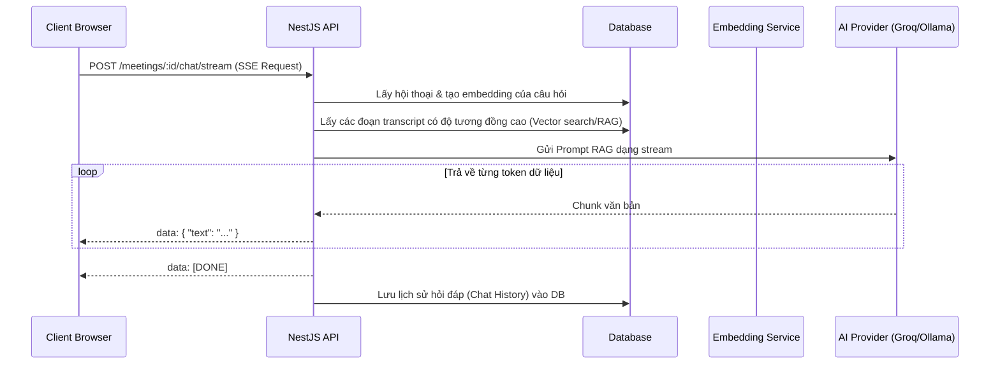

# Tài liệu kỹ thuật: Module Tóm tắt cuộc họp & Mẫu tóm tắt AI (AI Summaries & Templates)

Tài liệu này mô tả chi tiết kiến trúc, cơ sở dữ liệu, các API endpoints và thành phần giao diện của tính năng Tóm tắt cuộc họp bằng AI (AI Summaries) và Trình biên soạn Mẫu tóm tắt (Summary Templates) trong hệ thống MeetMind.

---

## 📌 Tổng quan tính năng

Tính năng Tóm tắt cuộc họp và Mẫu tóm tắt AI giúp tự động hóa quá trình ghi chép biên bản cuộc họp, cung cấp các thông tin chắt lọc chất lượng cao dựa trên công nghệ Mô hình ngôn ngữ lớn (LLM):
* **Mẫu tóm tắt đa dạng (Summary Templates):** Cho phép người dùng hoặc hệ thống định nghĩa các biểu mẫu tóm tắt có cấu trúc (Ví dụ: Họp dự án, Phỏng vấn tuyển dụng, Họp cải tiến Retro, v.v.). Mỗi mẫu gồm nhiều khối (block) như: Tóm tắt điều hành, Bảng phân công việc cần làm (Todo Table), Các quyết định quan trọng (Decisions).
* **Tự động dịch thoại & Chuyển chữ (Whisper Transcription):** Xử lý luồng ghi âm âm thanh từ LiveKit, gửi đến mô hình Whisper để dịch và chuyển thành biên bản hội thoại (transcript) theo dòng thời gian (timeline).
* **Tóm tắt bất đồng bộ (Background AI Summarization):** Luồng xử lý tóm tắt chạy dưới nền (background job) để tránh lỗi timeout của các HTTP request. Giao diện hiển thị trạng thái `[GENERATING]` và tự động tải lại dữ liệu khi hoàn thành.
* **Hỏi đáp thông minh về cuộc họp (AI Chatbot Q&A):** Hỗ trợ trò chuyện và hỏi đáp trực tiếp về nội dung cuộc họp bằng cơ chế streaming thời gian thực (Server-Sent Events) kết hợp với Cơ sở dữ liệu Vector để tìm kiếm ngữ cảnh (RAG).

---

## 🏗️ Kiến trúc & Luồng hoạt động (Workflows)

### 1. Luồng xử lý tóm tắt cuộc họp dưới nền (Background Job)

```mermaid
sequenceDiagram
    participant Client as Client Browser
    participant Backend as NestJS API
    participant DB as Database
    participant AI as AI Provider (Groq/Ollama)

    Client->>Backend: POST /meetings/:id/summaries/generate (Lựa chọn templateId)
    Backend->>DB: Đổi/Lưu trạng thái SummaryText thành '[GENERATING]'
    Backend-->>Client: Trả về bản ghi tạm thời (Hết block HTTP request)
    Note over Client: Client nhận trạng thái [GENERATING] -> Bắt đầu polling 3s/lần
    
    rect rgb(30, 30, 40)
        Note over Backend: Xử lý nền (Background Process):
        Backend->>Backend: Chờ các file audio in-flight biên dịch xong (Tối đa 10s)
        Backend->>DB: Lấy toàn bộ Transcripts của cuộc họp/phiên họp
        Backend->>DB: Lấy thông tin cấu hình Mẫu tóm tắt (Template)
        Backend->>AI: Gửi Prompt biên dịch kèm Transcript & Quy tắc mẫu
        AI-->>Backend: Trả về kết quả tóm tắt Markdown
        Backend->>DB: Cập nhật SummaryText = [Kết quả tóm tắt]
    end

    Note over Client: Polling tiếp theo -> Nhận nội dung mới -> Dừng polling và hiển thị Markdown
```


### 2. Luồng hỏi đáp AI Chatbot thời gian thực (SSE Streaming)


---

## 🗄️ Cơ sở dữ liệu (Database Schema)

Module này bao gồm hai thực thể chính được liên kết chặt chẽ:

### 1. `SummaryTemplate` (Bảng `summary_templates`)
Lưu trữ định nghĩa cấu trúc của từng mẫu tóm tắt.

| Tên cột | Kiểu dữ liệu | Mô tả |
| :--- | :--- | :--- |
| `id` | `uuid` (PK) | Khóa chính của mẫu tóm tắt |
| `name` | `varchar` | Tên hiển thị của mẫu |
| `description` | `varchar` | Mô tả ngắn gọn về công dụng |
| `purpose` | `enum` | Mục đích sử dụng (`interview`, `retro`, `custom`, v.v.) |
| `sections` | `jsonb` | Mảng chứa cấu trúc khối: `TemplateSectionDef[]` |
| `summaryStyle` | `varchar` | Phong cách tóm tắt (Ví dụ: `detailed`, `concise`) |
| `globalRules` | `text` | Quy tắc toàn cục ép buộc cho AI khi tạo tóm tắt |
| `isSystem` | `boolean` | `true` nếu là mẫu hệ thống (chỉ xem, không được xóa/sửa) |
| `createdByUserId` | `uuid` (FK) | Liên kết với bảng `users` tạo mẫu |
| `createdAt` | `timestamp` | Ngày tạo |
| `updatedAt` | `timestamp` | Ngày cập nhật |

#### Cấu trúc phần tử trong cột `sections` (`TemplateSectionDef`):
* `name`: Mã định danh (Ví dụ: `executive_summary`, `todo_table`).
* `label`: Tên hiển thị trên tiêu đề mục.
* `description`: Gợi ý điền nội dung.
* `blockType`: Loại khối hiển thị (`executive_summary`, `action_items`, `decisions`, `todo_table`, `custom`).
* `aiInstructions`: Chỉ dẫn cụ thể cho AI xử lý riêng cho khối này.
* `placeholders`: Cấu trúc Markdown mẫu để AI điền vào.
* `order`: Thứ tự sắp xếp các khối.

### 2. `Summary` (Bảng `summaries`)
Lưu trữ nội dung tóm tắt được tạo ra cho từng phiên họp.

| Tên cột | Kiểu dữ liệu | Mô tả |
| :--- | :--- | :--- |
| `id` | `uuid` (PK) | Khóa chính của bản tóm tắt |
| `meetingId` | `uuid` (FK) | Liên kết với bảng `meetings` |
| `sessionId` | `uuid` (FK) | Liên kết với bảng `meeting-sessions` |
| `summaryText` | `text` | Nội dung tóm tắt dạng Markdown (hoặc `[GENERATING]` khi đang xử lý) |
| `templateId` | `uuid` (FK) | Mẫu tóm tắt được sử dụng để tạo |
| `createdAt` | `timestamp` | Ngày tạo |
| `updatedAt` | `timestamp` | Ngày cập nhật |

---

## 🔌 API Endpoints

Mọi API yêu cầu Authorization header chứa JWT Token hợp lệ:

### 1. Lấy tất cả tóm tắt của cuộc họp
* **Endpoint:** `GET /meetings/:meetingId/summaries`
* **Phản hồi:** Mảng các bản tóm tắt (có kiểm tra quyền truy cập của từng phiên họp).

### 2. Khởi tạo/Tạo lại tóm tắt AI
* **Endpoint:** `POST /meetings/:meetingId/summaries/generate`
* **Body:**
  ```json
  {
    "sessionId": "session-uuid-123",
    "templateId": "template-uuid-456"
  }
  ```
* **Phản hồi:** Trả về đối tượng `Summary` với `summaryText` bằng `[GENERATING]`.

### 3. Streaming Hỏi đáp AI Chatbot (SSE)
* **Endpoint:** `POST /meetings/:meetingId/chat/stream`
* **Body:**
  ```json
  {
    "question": "Những ai được giao nhiệm vụ trong cuộc họp này?",
    "sessionId": "session-uuid-123"
  }
  ```
* **Phản hồi:** Dữ liệu dạng `text/event-stream` trả về từng token văn bản.

### 4. Lấy lịch sử nhắn tin với Chatbot
* **Endpoint:** `GET /meetings/:meetingId/chat/history?sessionId=...`

### 5. Quản lý Mẫu tóm tắt (`/summary-templates`)
* `GET /summary-templates` -> Lấy danh sách mẫu có sẵn.
* `POST /summary-templates` -> Tạo mẫu tóm tắt mới.
* `PUT /summary-templates/:id` -> Cập nhật cấu hình mẫu.
* `DELETE /summary-templates/:id` -> Xóa mẫu tóm tắt tự tạo.

---

## 💻 Giao diện & Tích hợp (Frontend)

Mã nguồn của module được bố trí tại:

### 1. Giao diện tóm tắt & Hỏi đáp cuộc họp
* **[MeetingSummaryTab.tsx](file:///home/theanh/meetmind/frontend/src/features/meetings/components/details/MeetingSummaryTab.tsx):**
  * **Cột trái (AI Summary):**
    * Cho phép chuyển đổi xem tóm tắt của các phiên họp cũ (Session History).
    * Trình chọn Mẫu tóm tắt để áp dụng khi tạo mới/tạo lại.
    * Cơ chế thông minh nhận diện trạng thái `[GENERATING]` để hiển thị hiệu ứng xoay lấp lánh (pulsed design) và tự động gọi API làm mới sau mỗi 3 giây (polling) cho tới khi hoàn tất.
  * **Cột phải (Q&A Chatbot):**
    * Tích hợp khung chat Hỏi đáp và danh sách câu hỏi gợi ý nhanh.
    * Sử dụng cơ chế đọc luồng `ReadableStream` (`reader.read()`) từ API SSE để hiển thị chữ chạy mượt mà (typing effect) theo thời gian thực.

### 2. Trình thiết kế Mẫu tóm tắt trực quan
* **[TemplatesPage.tsx](file:///home/theanh/meetmind/frontend/src/features/templates/TemplatesPage.tsx):**
  * Quản lý tạo/sửa/xóa các Mẫu tóm tắt cuộc họp.
  * Giao diện chia đôi: bên trái nhập thông tin cơ bản và tùy chỉnh các khối nội dung (sửa đổi chỉ dẫn AI, thêm placeholder); bên phải hiển thị bản xem trước giao diện kiểu Notion (Notion-style Live Preview) tự động kết xuất từ Markdown thời gian thực.
